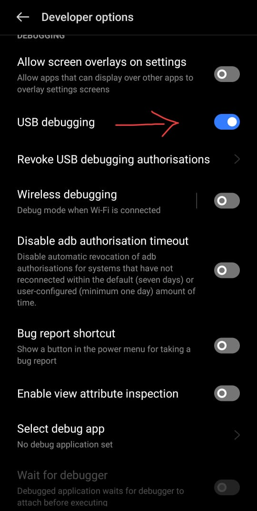

# 🖧 BridgeNet - A Graphical UI for Gnirehtet Reverse Tethering

BridgeNet is a modern, user-friendly desktop application that provides a graphical interface for [Gnirehtet](https://github.com/Genymobile/gnirehtet), allowing Android users to reverse-tether and share a PC's internet connection with their device via USB—ideal for restricted or unstable campus Wi-Fi environments.
---

## 🚀 Features

- 🔌 **One-Click Connection** to start/stop Gnirehtet on connected Android devices
- 📡 **Auto-Reconnect** to maintain connection stability during outages
- 🌐 **DNS Override & MTU Config** to fine-tune network performance
- 📱 **ADB Device Detection** with live connection status
- 🔧 **Custom Settings Panel** for network tweaks
- 🧠 **Real-Time Logs** for debugging and monitoring
- 🪟 **Built for Windows**, Linux support coming soon

---

## 🛠️ Technologies Used

- **Language & Runtime:** Python 3.11  
- **GUI Framework:** PyQt5  
- **ADB Integration:** Python `subprocess` & Android Debug Bridge  
- **Reverse Tethering:** Gnirehtet CLI & Android `VpnService`  
- **Networking:** TCP/IP, Configurable MTU/DNS  
- **Packaging:** PyInstaller for `.exe` distribution  
- **Monitoring:** Python `logging` + PyQt widgets  
- **CI/CD:** GitHub Actions  

---

## 🧰 Prerequisites

Before using BridgeNet, ensure the following on your Android device:

### 🔑 Enable Developer Options and USB Debugging

1. **Unlock Developer Options:**
   - Navigate to `Settings > About phone`.
   - Tap **Build number** seven times until you see a message confirming you're a developer.

   

2. **Enable USB Debugging:**
   - Go to `Settings > System > Advanced > Developer Options`.
   - Toggle **USB debugging** to ON.

   

> 📌 **Note:** When you connect your device to the PC for the first time, a prompt will appear asking to allow USB debugging. Ensure you check **"Always allow from this computer"** and tap **OK**.


### 🚫 Disable Permission Monitoring (If Applicable)

Some Android devices, particularly Samsung models, have a feature called **App Permission Monitor** that can interfere with reverse tethering. To disable it:

1. Navigate to `Settings > Lock screen and security > App permission monitor`.
2. Toggle the feature OFF or disable it for specific apps as needed.


> 📌 **Note:** The availability and location of this setting may vary based on your device model and Android version.

---

## 🔧 Setup Instructions

```bash
# Clone the repository
git clone https://github.com/your-username/bridgenet-gnirehtet-gui.git
cd bridgenet-gnirehtet-gui

# Install dependencies
pip install -r requirements.txt

# Run the GUI
python main.py
